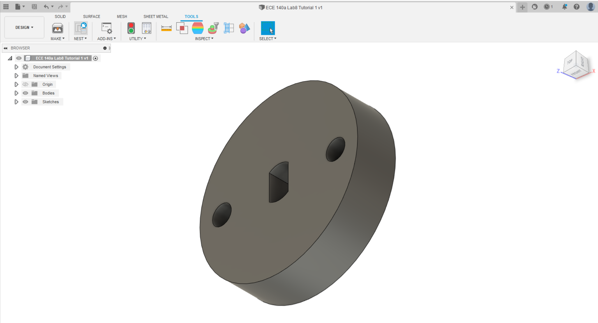
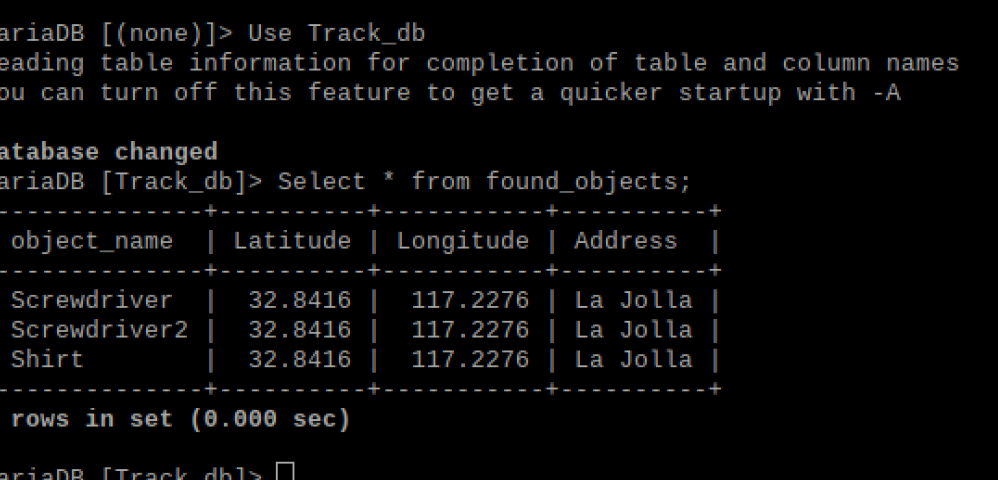

# Name 1: Frederick Zieber, PID: A12864749
# Name 2: Cole Rindal, PID:A16579270

# Lab 8

## Tutorial 1: 

In this Tutorial, we used fusion 360 to model a basic camera mount for our raspberry pi camera. We have a lot of experience with CAD and 3D modeling software so this was a very simple part to create. The hardest part was figuring out that the center hole was a center point rectangle with center point arc that trims the rectangle and not a filet on the rectangle. Otherwise no real issues with this tutorial.

## Tutorial 2: 

In this Tutorial, we learned how to use the GPS module to extract signal data and return the coordinates of our device in terms of Latitude and Longitude. We also learned how to prepare the Raspberry Pi to accept such data for processing.

## Tutorial 3: 

In this Tutorial, we learned how to use our camera and color segmentation to detect the largest object in a color range and print the ditance from the center the object is horizontally. We do this by first detecting objects of a certain color, making those pixels white and the rest black, then we remove stray pixels unrelated to the object, or "denoise" the image. Then, we make pixels for the same object a connected component, get the largest object, and finally calculate the distance from center.

## Tutorial 4: 

In this Tutorial, we learned how to use the Stepper Motor, and the RpiMotorLib library. We made the motor rotate in each direction using the motor_run command 50 times each. Upon experimenting with the command, we learned that changing the step size changes how much the motor moves with each command (half step is half the change of a full step), and changing wait time changes the speed of the commands being processed.

## Tutorial 5: 

In this Tutorial, we learned how to implement a control system, and , when combined with tutorials 3 and 4, learned how to make a camera rotate in order to center the largest object. Our control system takes proportional, derivative, and integral gain to determine how fast to rotate the camera when trying to center the largest object. 

## Challenge:

For the Challenge, we intend to use what we learned in the tutorial to create a dinamic webpage and sql database that when an object is selected and a button is pushed, the camera will follow the largest object matching the color of the selected object. When Esc is then pressed, the neww GPS location is then displayed on the webpage, with name + count for multiple entries. When the Save button is pushed, the data is then saved to a corresponding Sql table.

For a demo, follow the following link:

[Challenge Video Demo!](https://youtu.be/-NdKpmu7b4g)

The image of the corresponding found\_objects table is here:

### How to use:

For our code to run, be sure to create the database Table\_db and grant relevant privileges, as well as overwrite credentials.env with appropriate credentials. After this is done, run init\_db.py to initialize the tables, then run app.py. Now, the site is running on localhost:6543 on the Raspberry! Use a means of accessing the Raspberry's desktop (such as VNC Viewer), pull up localhost:6543, and the site should load. From here, change the input to the image you prefer, hit Track, and the object can now be tracked. When Tracking is done, press Esc to update the site with relevant coordinates and stop tracking. When you want to save the tracked object data to found_objects, press the Save button.

### File Descriptions:

Our approach consists of the following in each file:

credentials.env: Stores Environment Variables for the credentials needed to access MySql. _Warning! Replace with valid credentials for your device as needed!_

init\_db.py: This python file connects to MySql using credentials.env, creates the database Track\_db if it does not already exist, and tells MySql to use said database. It then deletes any existing tables, and creates new tables to be used by app.py.

index.html: HTML file used to generate the webpage. Consists of a title and header, a drop-box input, a track and a save button, and a set location for the resulting table and text to be displayed. The buttons each call functions from rest.js, updating the webpage accordingly.

rest.js: Javascript file consisting of two functions. The start\_Tracking\(\) function reads the input value for the object id, creates a URL using the input, fetches the URL for the json response containing the relevant data, then the response is displayed in the form of a table on the site and the latest recorded GPS location. The save\_Table\(\) function reads the input value for the object id, creates a URL using the input, fetches the URL so app.py can update the found_objects table.

GPS.py: This python file is practically identical to tutorial 2, except it takes a boolean value input from app.py which if false, returns default data, but if true, collects the GPS coordinates once and returns to app.py the Coordinates and City for potential reverse geocode implementation.

Camera.py: This python file is almost identical in functionality to Tutorial 5, except it takes input lists for color constraints as inputs from app.py, tracks the largest object matching said constraint, then when Esc is pushed, returns to app.py a boolean Found as true if an object is detected, false otherwise.

app.py: This python file first loads the credentials needed for MySql, then creates three route-view pairs, a static view, configures the app, and sends the information to local host 6543. The first route-view pair creates a home route generated by index.html. The second pair handles the URLs generated in rest.js function start\_Tracking\(\)  as route "track", and generates the view based on index.html with the changes made using the response from begin\_tracking\(req\). 
The third pair handles the URLs generated in rest.js function save\_Table\(\)  as route "save", and generates the view based on index.html with the changes made using the response from save\_data\(req\). begin\_tracking\(req\) takes the input id, collects relevant hsv values for appropriate object in objects table, sends hsv constraints to Camera.py until tracking stops, sends resulting boolean Found to GPS.py for relevant coordinates if an object was found, then sends most recent object/location data for use in rest.js in updating the html file. save\_data\(req\) takes the data collected so far of tracked objects and their coordinates, then saves them to the found_objects table. _Warning! Use localhost:6543 if 0.0.0.0:6543 causes issues!_