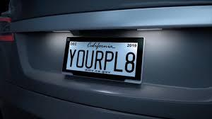

# Name 1: Frederick Zieber, PID: A12864749
# Name 2: Cole Rindal, PID:A16579270

# Lab 7

## General Outline

For this lab, we learned about how to incorporate the use of a camera with our Raspberry Pi. In the Tutorials, we learn how to take a picture with the camera and how to read text from an image, so that in the Challenge, we can learn how to create a restful server that reads the liscence plate in an image and returns it as text, and saves the output shown on screen to a database.

## Tutorial 1: 

In this Tutorial, we learned how to use the camera with the Raspberry pi. We installed the necessary software, ran the five lines of code, and took a picture with the camera as a result.

## Tutorial 2:

In this Tutorial, we learned how to use image processing and tesseract to read the text in an image. The specific goal for this tutorial was to take a picture of a sudoku puzzle and return the solved output as a 2d array. First we resized and reshaaped the image so that the sudoku puzzle, no matter the angle, became an evenly distributed 900x900 image, then we used tesseract to read each square in the resized image into a 2d array, then we solved the puzzle. 

## Challenge:

For the Challenge, we intend to use what we learned in the tutorial to create a dinamic webpage and sql database that takes an image, finds a liscence plate in the image, reads the text from it, displays relevant image and text, and saves image, timestamp, and text to the table in the sql database. We highly recomend running our submission on a Raspberry Pi for better results.

If we were to use a live video feed, we would most likely run a seperate file that is contantly taking pictures every 150 frames and saving them to the list, and change the input in the html into a number for the image saved id. Most, if not all, of the rest of the code can remain the same.

For a demo, follow the following link:

[Challenge Video Demo!](https://youtu.be/sUnncxxp7hc)

The image with best results using the Raspberry Pi is here:

### How to use:

For our code to run, be sure to create the database Plate\_db and grant relevant privileges, as well as overwrite credentials.env with appropriate credentials. After this is done, run init-db.py to initialize the table, then run detector.py. Now, the site is running on localhost:6543 on the Raspberry! Use a means of accessing the Raspberry's desktop (such as VNC Viewer), pull up localhost:6543, and the site should load. From here, change the input to the image you prefer, hit Display, and the image and relevant text will load on screen.

### File Descriptions:

Our approach consists of the following in each file:

credentials.env: Stores Environment Variables for the credentials needed to access MySql. _Warning! Replace with valid credentials for your device as needed!_

init-db.py: This python file connects to MySql using credentials.env, creates the database Plate\_db if it does not already exist, and tells MySql to use said database. It then deletes any existing Data\_Table table, and creates a new table of the same name that contains columns for image name, timestamp, and image text.

index.html: HTML file used to generate the webpage. Consists of a title and header, an integer input, a display button, and a set location for the resulting image and text to be displayed. The display button calls a function from rest.js, updating the webpage accordingly.

rest.js: Javascript file consisting of the function click\_display\(\), which reads the input value for the image id, creates a URL using the input, fetches the URL for the json response containing the relevant data, then the response is displayed in the appropriate section of the site. 

detector.py: This python file first loads the credentials needed for MySql, then creates two route-view pairs, a static view, configures the app, and sends the information to local host 6543. The first route-view pair creates a home route generated by index.html. The second pair handles the URLs generated in rest.js as route "photos", and generates the view based on index.html with the changes made by click\_display\(\) in rest.js using the response from get\_photo\(req\). get\_photo\(req\) takes the input integer, saves the img\_src for the given id, calls detect\_plate\(img\) on the imd\_src, calls get\_text\(img\) on the resulting cropped image, and returns a json consisting of the img_src for the img and the text from the image for use in rest.js. _Warning! Use localhost:6543 if 0.0.0.0:6543 causes issues!_

