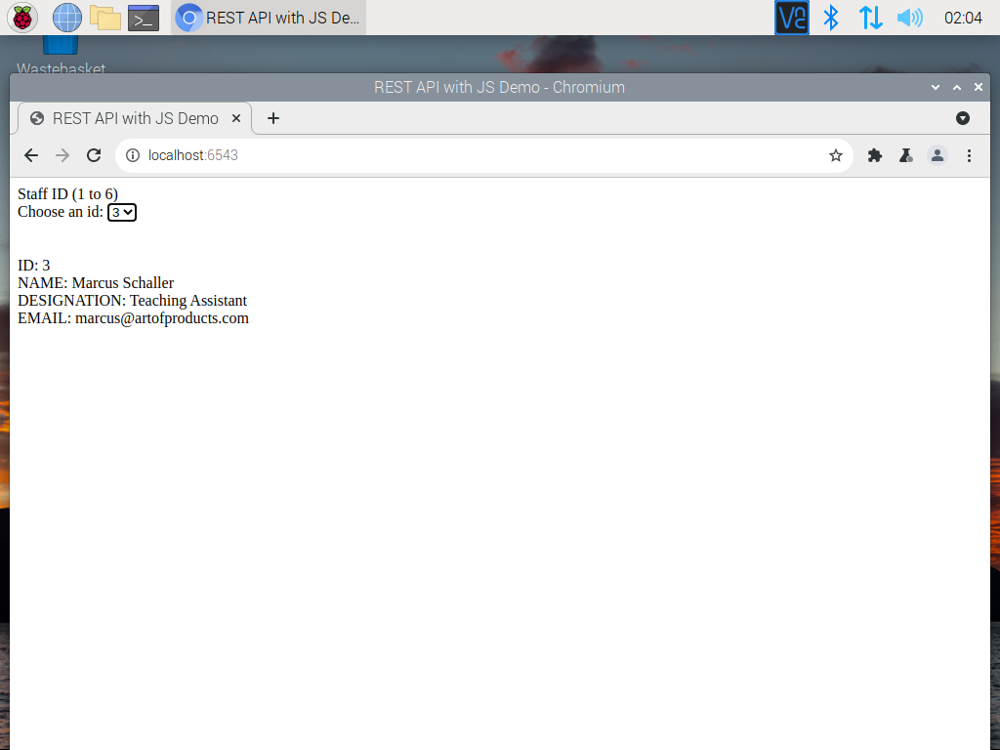
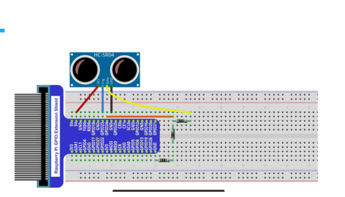
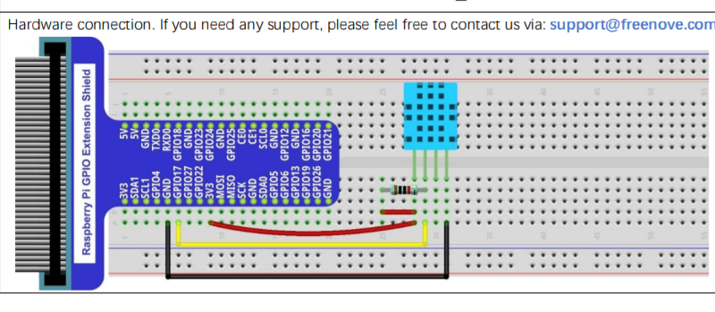

# Name 1: Frederick Zieber, PID: A12864749
# Name 2: Cole Rindal, PID:A16579270

# Lab 6

## General Outline

For this lab, we learned about how to use a Raspberry pi and how incorporate hardware, so as to prepare for our midterm submission. For the Midterm, we were to use our knowlege on Restful servers, databases, queries, and our newly aquired knowlege on Raspberry pis and hardware to create a system of our own design.

## Tutorial 1: 

In this Tutorial, we prepared our Raspberry pi for use in Tutorial 2 and our Midterm. After installing all necessary software and packets we intend to use, we then had to prepare mysql for use, and finally run Lab 5 Tutorial 3 or Lab 5 Challenge 1. Screenshot of running Tutorial 3 can be seen below.

## Tutorial 2:

In this Tutorial, we learned how to use python, the Raspberry, and our electronic kit to create a motion sensor. After following the instructions on how to connect the ultrasonic sensor and a buzzer to the GPIO board, and connect that to the PI, we ran the relevant python file to finish the motion sensor. We did all of this in order to prepare for making our own system for the Midterm. 

## Midterm:

For the Midterm, we decided to use the ultrasonic ranging module and the DHT-11 hygrothermograph as our two inputs to store four elements to a table in our MYSQL database: id, temperature, humidity, and distance. id is uniquely designated by the "cycle from start". We then use a Restful route to collect data from the table as a JSON and display the values based the query criteria. Said criteria consists of a valid temperature reading (>-100 degrees), and the two input criteria of time (cycles from start) and distance, both of which ask for an input min and an input max value to construct the ranges for the query. Finally, there is a warning button so that if pushed, a variable is toggled, so that the next submit button push will result in either the buzzer and LED will turn on or off, depending on the newly set variable.

For a demo, follow the following link:

[Midterm Video Demo!](https://m.youtube.com/watch?v=SGZRxeeTkvE)

### How to use:

For our code to run, be sure to create the database Midterm\_db and grant relevant privileges, as well as overwrite credentials.env with appropriate credentials. After this is done, open two terminals on your computer (not the Raspberry) and ssh into the Raspberry. Next run init-db.py in one terminal to initialize the table, then run sensor.py to collect data. While its running, or after you stop it, use the other terminal (or same one if sensor was stopped) and run app.py from here. Now, the site is running on localhost:6543 on the Raspberry! Use a means of accessing the Raspberry's desktop (such as VNC Viewer), pull up localhost:6543, and the site should load. From here, change the input ranges to how you prefer, hit Submit, and a table of relevant data, or ean empty table will load on screen. If you wish to "alert the hardware operator" (activate the buzzer) press
the Warning button and hit submit. Repeat this process to turn off the buzzer.

### Hardware:

For the hardware circuit construction, we started off with the ultrasonic ircuit from tutorial 2 following the wiring diagram below:

Then, we added the DHT-11 following the wiring diagram shown here:

Lastly, weconnected a piezoelectric buzzer and an LED with jumper cables connecting their positive ends to GPIO6 and Negative ends to ground, so that both or neither are active. That concludes how to build our hardware portion to run our code. On to the Software!

### Software:

Our approach consists of the following in each file:

credentials.env: Stores Environment Variables for the credentials needed to access MySql. _Warning! Replace with valid credentials for your device as needed!_

init-db.py: This python file connects to MySql using credentials.env, creates the database Midterm\_db if it does not already exist, and tells MySql to use said database. It then deletes any existing Data\_Table table, and creates a new table of the same name.

index.html: HTML file used to generate the webpage. Consists of a title and header, four text inputs, for time and distance ranges, a submit button, a warning button, and a set location for the table to be displayed. The two Submit and warning buttons each call functions from rest.js, though only click\_display\(\) when the Submit button is pressed is the only time the webpage is updated other than changing inputs.

rest.js: Javascript file consisting of two functions: 1. toggle\_warning\(\), which switches the global variable isWarning is the warning button is pushed, then returns isWarning, and 2. click\_display\(\), which calls toggle\_warning without changing isWarning to get the state and reads the input values for the minimum and maximum values for time and distance, creates a URL using all four inputs, fetches the URL for the json response containing the relevant data, then if no ranges are set, nothing is displayed in the table section of the webpage. If at least one input range is set, then the response is converted into a table, and displayed in the appropriate section of the site. 

app.py: This python file first loads the credentials needed for MySql, then creates two route-view pairs, a static view, configures the app, and sends the information to local host 6543. The first route-view pair creates a home route generated by index.html. The second pair handles the URLs generated in rest.js as route "data", and generates the view based on index.html with the changes made by click\_display\(\) in rest.js using the response from get\_data\(req\). get\_data\(req\) takes the input ranges, activates/deactivates the buzzer as applicable, queries the database for any entries that meet the conditions on time and distance, and returns a json consisting of the id, temperature, humidity, and distance for use in rest.js. _Warning! Use localhost:6543 if 0.0.0.0:6543 causes issues!_

sensor.py: This file is used for collecting data from the sensors to then be saved to the database in preparation for app.py. First the credentials for mysql are loaded in, then the GPIO board pins are set up, then an infinite loop begins until the program is forcefully terminated. In said loop, the distance is collected from the ultrasonic sensor using getSonar\(\) and pulseIn\(\), then the DHT-11 collects data until a valid reading is aquired (or 10 seconds pass) to be passed into humidity and temperature. Lastly, a new entry is inserted and committed to the table with the entries from id, temperature, humidity, and distance recorded from the current iteration, before id is incremented and the loop begins anew.

Freenove\_DHT.py: This file is used for constructing the library used in sensor.py.

setup.py: This file is used for setting up the GPIO for sensor.py.

